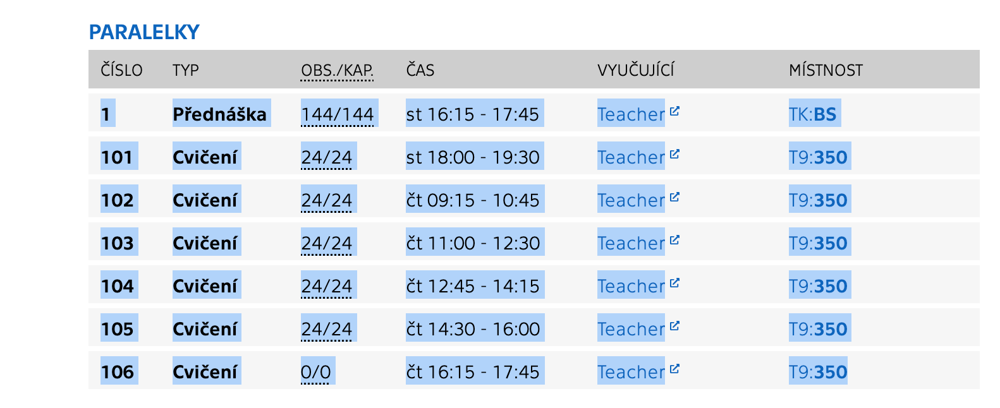

```
  _   _                _        _     _       ____ _____ _   _ 
 | |_(_)_ __ ___   ___| |_ __ _| |__ | | ___ / ___| ____| \ | |
 | __| | '_ ` _ \ / _ \ __/ _` | '_ \| |/ _ \ |  _|  _| |  \| |
 | |_| | | | | | |  __/ || (_| | |_) | |  __/ |_| | |___| |\  |
  \__|_|_| |_| |_|\___|\__\__,_|_.__/|_|\___|\____|_____|_| \_|
```
                                                              
# timetableGEN
Timetable generator for course timetabling problem using genetic algorithm.

This generator is useful for selecting specific course classes from a set of timeslots, such that the resulting timetable is the most optimal based on several criteria.

For finding the best timeslots for all courses, a population-based optimization algorithm ([evolution algorithm](https://en.wikipedia.org/wiki/Genetic_algorithm)) is used.

The resulting timetable can be can be optimized based on multiple criteria, such as: minimizing conflicts in the schedule, keeping timeslots continuous throughout the day and week, preferring earlier or later timeslots, and favoring or ignoring specific classes.

This project was started was created as a part of my 'The basics of artificial intelligence' course at FIT CTU.
As such, the generator is intended to be used by FIT CTU students for scheduling their timetables at the start of the semester, but it can be easily expanded for other uses.

### Timetable structure

The internal structure for representing courses is as follows: A semester is composed of several courses (e.g. "Programming and Algorithmization 1", "The Basics of Artificial Intelligence"...), each of these courses has several schedules (e.g. lectures, labs...) and each schedule has several entries (specific classes in a specific room).

The resulting timetable must contain one entry for each schedule. The process of generating a timetable is about selecting the appropriate entry for each schedule.


## Getting started

### Prerequisites

<details open>
<summary>Native</summary>
<br>

- C++ compiler (g++)
- Make
- *(If documentation is needed)* Doxygen
</details>

<details>
<summary>Dockerised</summary>
<br>

- Docker
</details>

### Compiling and running

<details open>
<summary>Native</summary>
<br>

1. Clone or download the repository
2. Navigate to the project's root directory
3. Run `make` to compile the project, a binary will be created in *./bin/timetablegen* directory
4. Execute the binary

*(If documentation is needed)* Run `make doc`, which will create documentation in *./doc* directory using Doxygen in HTML format.
</details>

<details>
<summary>Dockerised</summary>
<br>

1. Clone or download the repository
2. Navigate to the project's root directory
3. Run `docker build -t timetablegen .` to build the image
4. Create a *data* directory, which will contain input files
5. Run the image by `docker run -it --rm -v ./data:/data timetablegen`, the data directory will be mounted to the container as a volume, threfore every file in the `./data` directory will be reachable in */data* directory in the container
</details>

## Usage

The application is currently designed for **generating timetables at FIT Czech Technical University, using the command line**. However, it can be easily extended to support other data sources or forms of control.

**This manual will further consider only this use-case**.

### Input

After launching the application, a prompt will appear to enter the path to the file with the time entries information.

The application uses a parser to process the input and extract the entries data. The parser can handle tables of parallels copied from the course page in the new KOS system (in Czech language) in text format. (again, other forms of input or other parsers are not included, but it is relatively easy to add them).


#### File preprocessing

To prepare the input file: 
1. simply **copy the table of parallels from KOS for each course** that should be included in the final timetable
2. **add the name of the course** before each copied table 
3. **separate the sections** for different courses **with blank lines**
No further modification should be necessary.

The expecet format then looks like this:
```
course name
ID of the entry
schedule of entry (name of schedule this entry belongs to)
capacity information for entry
time slot of entry
(optional) parity information of timeslot
[if a entry has more timeslots, additional timeslots can be here]
additional infomration about entry
[another entry for this course (again, starting with ID of the entry)...]

[another course and its entries (again, starting with name of course...]
```

For example input files, see *examples* directory

### Priorities and options

After processing the input, the aplication asks for adjustment of timetable generation priorities and options.

By default, the algorithm tries to generate **timetables without collision**.
There are multiple other options that can be enabled:
  - **keeping timeslots continuous throughout the day** (will try not to create gaps in the timetable during the day)
  - **keeping timeslots continuous throughout the week** (will try not to create blank days in the schedule during the week unless the blank day is at the beginning or end of the week)
  - **maximum preferred continuous hours** + option to set how big the gap in minutes should be between entries to count them as consecutive (will try to create a gap in the timetable after a given number of continuous hours in a day)
  - **earliest preferred start hour in a day** (sets the earliest hour before which entries should not start)
  - **latest preferred start hour in a day** (sets the latest hour after which entries should not start)
  - **ignore scheduling for entries** (selects schedule of course, e.g. lectures of the course, that will not be taken into account in the timetable, i.e. they will be in the final timetable but will not be subject to any scheduling requirements)
  - **set priority for entries** (adds a special bonus or malus score to a specific entry that adjusts its chance of appearing in the generated schedule)


### Generation

The application will then allow to select the number of generations for the genetic algorithm to run. The default number should be sufficient in most cases.

Once the algorithm has completed, the application will display the best timetable generated by the algorithm run.
